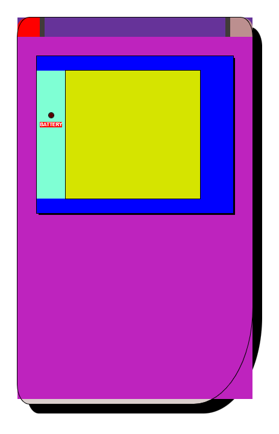
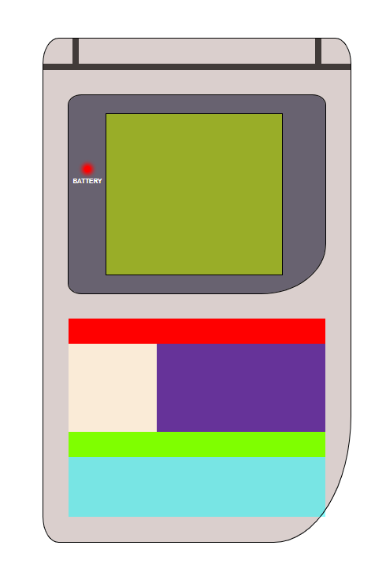
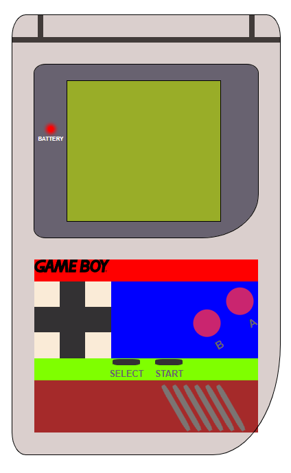

## - Repositorio del proyecto: https://github.com/Gaston-Valentini/proyect2-videoConsole
## - Título: GAMEBOY
## - Desarrollador: Gastón Valentini
## - Descripción: Proyecto realizado en GeeksHubs Academy, se trata de el diseño de una interfaz de videojuego, en el que se aplican diversas funciones.
## - Objetivo: Demostrar conocimientos adquiridos en diseño y maquetación en el primer módulo de cursado y programación en el segundo módulo con JavaScript.
## Tecnologías utilizadas:
#### * HTML5 (Diseño general de la página)
#### * CSS3 (Se utilizó para dar estilos a la mayoría de los componentes, logrando un diseño responsivo mediante media queries)
#### * JavaScript (Se utilizó para darle interacción al usuario y funcionalidad al proyecto según los requisitos necesarios)
## - Estructura del proyecto: Además de este README.md, el proyecto consta de la siguiente estructura:
#### * index.html (Se encuentra en la raíz del proyecto y es el archivo principal que importa el resto de los archivos del proyecto)
#### * Carpeta CSS (Dentro encontramos el archivo que contiene los estilos del proyecto)
#### * Carpeta de Audio e Images (Contienen los archivos multimedia del proyecto respectivamente)
## Previsualización de la maquetación:
#### - Maquetación de la pantalla

#### - Maquetación de los botones

## - Funcionalidad (se detalla el funcionamiento en comentarios del código):
#### * START: Enciende y apaga la consola.
#### * A: Permite desplazar las imágenes en sentido descendente.
#### * B: Permite desplazar las imágenes en sentido ascendente.
## - Bugs conocidos:
#### * No se han detectado bugs en el proyecto hasta la fecha (23/09/2023)